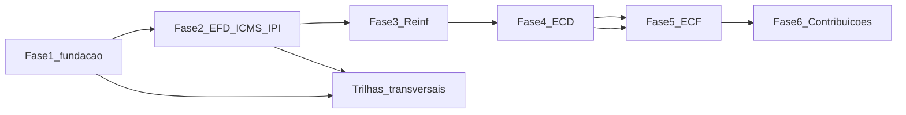

# Plano — Fases 2 a 6 + trilhas transversais (pós Fase 1)

**Status:** Fases 1–17 implementadas localmente em `feat/soc2-grounding-erp3` (sem push).  
**Próximo:** [`PHASE_18_CAMPAIGNS_PARTNER_BILLING_MOBILE_PLAN.md`](PHASE_18_CAMPAIGNS_PARTNER_BILLING_MOBILE_PLAN.md).  
**Gates:** `tsc` ok · testes unitários.  
**Regra permanente:** fonte oficial → regra versionada → fixture → testes → evidência no lab → só então subir `ObligationMaturity`.  
**Deploy/push/transmissão:** só com autorização **por fase**.

Ordem oficial do SUPERMEGAPROMPT (mantida neste plano):

1. ~~Fase 1 — Fundação~~ (feita)
2. ~~Fase 2 — EFD ICMS/IPI commons~~ (feita; `internal_beta` até 1ª evidência PVA)
3. ~~Fase 3 — EFD-Reinf~~ (feita; `development`)
4. ~~Fase 4 — ECD~~ (feita; `development`) → [`PHASE_4_ECD_PLAN.md`](PHASE_4_ECD_PLAN.md)
5. ~~Fase 5 — ECF~~ (feita; `development`) → [`PHASE_5_ECF_PLAN.md`](PHASE_5_ECF_PLAN.md)
6. ~~Fase 6 — EFD-Contribuições~~ (feita; `internal_beta`) → [`PHASE_6_CONTRIBUICOES_PLAN.md`](PHASE_6_CONTRIBUICOES_PLAN.md)
7. ~~Fase 7 — Plataforma operacional~~ (feita; plataforma `internal_beta`) → [`PHASE_7_OPS_PLATFORM_PLAN.md`](PHASE_7_OPS_PLATFORM_PLAN.md)
8. ~~Fase 8 — RTC / CBS·IBS·CRTB~~ (feita; módulo `development`) → [`PHASE_8_RTC_PLAN.md`](PHASE_8_RTC_PLAN.md)
9. ~~Fase 9 — Homologação oficial~~ (feita; processo `internal_beta`) → [`PHASE_9_HOMOLOGATION_PLAN.md`](PHASE_9_HOMOLOGATION_PLAN.md)
10. ~~Fase 10 — Operação contínua~~ (feita; `internal_beta`) → [`PHASE_10_CONTINUOUS_OPS_PLAN.md`](PHASE_10_CONTINUOUS_OPS_PLAN.md)
11. ~~Fase 11 — Governança enterprise / SLA~~ (feita; plataforma `official_validator_beta`) → [`PHASE_11_ENTERPRISE_GOVERNANCE_PLAN.md`](PHASE_11_ENTERPRISE_GOVERNANCE_PLAN.md)
12. ~~Fase 12 — Certificação · marketplace · ERP live~~ (feita; `official_validator_beta`) → [`PHASE_12_CERTIFICATION_MARKETPLACE_PLAN.md`](PHASE_12_CERTIFICATION_MARKETPLACE_PLAN.md)
13. ~~Fase 13 — Multi-região · DR · billing~~ (feita; `internal_beta`) → [`PHASE_13_MULTI_REGION_DR_BILLING_PLAN.md`](PHASE_13_MULTI_REGION_DR_BILLING_PLAN.md)
14. ~~Fase 14 — SLO · parceiros · ERP live+~~ (feita; `internal_beta`) → [`PHASE_14_SLO_PARTNERS_ERP_PLAN.md`](PHASE_14_SLO_PARTNERS_ERP_PLAN.md)
15. ~~Fase 15 — Compliance pack · multi-país~~ (feita; prep `official_validator_beta`) → [`PHASE_15_COMPLIANCE_INTERNATIONAL_PLAN.md`](PHASE_15_COMPLIANCE_INTERNATIONAL_PLAN.md)
16. ~~Fase 16 — Marketplace público · assist · mobile~~ (feita; `internal_beta`) → [`PHASE_16_MARKETPLACE_ASSIST_MOBILE_PLAN.md`](PHASE_16_MARKETPLACE_ASSIST_MOBILE_PLAN.md)
17. ~~Fase 17 — SOC2 prep · grounding · ERP #3~~ (feita; prep `official_validator_beta`) → [`PHASE_17_SOC2_GROUNDING_ERP_PLAN.md`](PHASE_17_SOC2_GROUNDING_ERP_PLAN.md)
18. **Fase 18 — Campanhas · partner billing · mobile generate** → [`PHASE_18_CAMPAIGNS_PARTNER_BILLING_MOBILE_PLAN.md`](PHASE_18_CAMPAIGNS_PARTNER_BILLING_MOBILE_PLAN.md)



---

## Fase 2 — EFD ICMS/IPI (escopos comuns + PVA)

**Branch:** `feat/efd-icms-ipi-commons-pva`  
**Maturidade alvo:** `official_validator_beta` nos commons; `validated_scope` **somente por cenário** com evidência PVA (nunca “tudo”).

### Implementar

| # | Entrega | Notas |
|---|---------|--------|
| 1 | Bloco 0 completo quando cadastro existir | 0000/0001/0005/0100/0150/0190/0200/0400; bloquear se CRC/COD_MUN/IE faltarem |
| 2 | Bloco C comum | C100 eletrônico, C170 omitido conforme Guia, C190 COD_OBS; cancelados/comp/dev só com XML/evento |
| 3 | Apuração E parcial auditável | E100/E110 com saldo **manual/prior**; E111+/a recolher só com COD_REC; sem soma silenciosa |
| 4 | Bloco 9 golden | Contadores determinísticos cobertos por teste |
| 5 | Plugins UF (esqueleto) | `efd-icms-ipi/uf/{UF}.ts` — seed vazio; SP só com fonte citada |
| 6 | Auditoria XML × EFD | Chaves ausentes, totais C100 × XML |
| 7 | Lab PVA + matriz | `contentHash` + fixture id; preencher `PVA_TEST_RESULTS` / `VALIDATION_EVIDENCE` |

### Não fazer nesta fase

G/H/K completos, transmissão, CBS/IBS/IS.

### Critérios de saída

- [`docs/EFD_ICMS_IPI_SUPPORT_MATRIX.md`](EFD_ICMS_IPI_SUPPORT_MATRIX.md) atualizado (INTERNAL/PVA só com evidência)
- Fixtures anônimas + golden TXT parcial + unit de apuração
- ≥1 cenário `ok` no PVA registrado no lab (**real**)
- Profile: `official_validator_beta` se houver evidência; `validated_scope` só nos cenários listados

### Fase 2b (opcional, depois)

G/CIAP, H/inventário, K/produção, energia/comunicação, mapas de crédito avançados.

---

## Fase 3 — EFD-Reinf (ambiente restrito + lifecycle)

**Branch:** `feat/reinf-event-engine`  
**Maturidade alvo:** `development` → `internal_beta`; transmissão restrita só com WS documentado + agente de certificado local.

### Implementar

| # | Entrega |
|---|---------|
| 1 | Catálogo de eventos versionado (JSON/YAML em sources/; R-1000 + subset R-2000/R-4000 + fechamento/reabertura/exclusão) |
| 2 | Lifecycle `ReinfEventStatus` persistido (IDB + Supabase) |
| 3 | XML canônico + hash + lote; **nunca** senha/PFX no browser/logs |
| 4 | Agente local de assinatura (spec + stub); produto recebe XML assinado/recibo |
| 5 | Cliente WS atrás de `FEATURE_REINF_SUBMIT`; default **ambiente restrição**; retry idempotente |
| 6 | Conciliação DCTFWeb via **import** de relatório oficial (sem fingir portal) |
| 7 | Mestres: obra, tomador, beneficiário |
| 8 | Cockpit: células Reinf + atraso (calendário com fonte) |

### Critérios de saída

- Testes de serialização/lifecycle **sem rede**
- `docs/REINF_EVENT_ENGINE.md` sair de “planned”
- Zero deploy de transmissão até autorização + checklist de certificado
- Sem `production` sem evidências de ambiente restrito

---

## Fase 4 — ECD (motor contábil)

**Branch:** `feat/accounting-engine-ecd`  
**Maturidade alvo:** `development` → `internal_beta`; `official_validator_beta` com Programa ECD.

### Implementar

| # | Entrega |
|---|---------|
| 1 | Plano de contas (vigência, natureza, níveis, referencial) no hub mestres |
| 2 | Lançamentos partidas dobradas, equilíbrio, lote, imutabilidade pós-aprovação |
| 3 | Importadores CSV/XLSX/JSON (início do framework de conectores genéricos) |
| 4 | Livros: Diário, Razão, balancetes; BP/DRE básicos a partir do ledger |
| 5 | Cockpit contábil (pendências, partidas quebradas, saldos invertidos) |
| 6 | Plugin ECD deixa DEMO quando houver ledger real; readiness bloqueia DEMO em modo oficial interno |
| 7 | Import ECD anterior (TXT → canônico com lineage de linha) |

### Critérios de saída

- Fixture ledger sintético → TXT ECD → validação interna
- `ACCOUNTING_ENGINE.md` + `ECD_PROFESSIONAL_SCOPE.md` atualizados
- **ECF não avança** até isto fechar

---

## Fase 5 — ECF (sobre ECD)

**Branch:** `feat/ecf-from-ecd` — **feita** (`development`; IRPJ flag off).  
**Maturidade alvo:** `foundation` → ~~`development`~~ → `internal_beta` (IRPJ/CSLL sem liberação comercial prematura).

### Implementar

| # | Entrega |
|---|---------|
| 1 | Recuperação canônica ECD ativa + ECF anterior |
| 2 | Mapeador conta × referencial (UI + órfãs) |
| 3 | Import tabelas dinâmicas / planos referenciais (arquivos versionados; sem hardcode gigante) |
| 4 | e-Lalur / e-Lacs Parte A/B (modelo + persistência + aprovação); limites só com fonte |
| 5 | Motor IRPJ/CSLL determinístico com memória — gate: testes + Programa ECF + revisor humano |
| 6 | Conciliação ECD×ECF, diff ECF anterior, lab. Programa ECF |

### Critérios de saída

- `development` com mapper + recuperação; `internal_beta` se e-Lalur estrutura ok
- Sem `validated_scope` sem evidência oficial
- Docs `ELALUR_ELACS_ENGINE.md` / `ECF_PROFESSIONAL_SCOPE.md` atualizados

---

## Fase 6 — EFD-Contribuições (histórica + 2026 + pós-2027)

**Branch:** `feat/efd-contribuicoes-ledger` — **feita** (`internal_beta`; PGE evidence pendente).  
**Plano detalhado:** [`PHASE_6_CONTRIBUICOES_PLAN.md`](PHASE_6_CONTRIBUICOES_PLAN.md)  
**Maturidade alvo:** ~~`development` → `internal_beta`~~ (atingido estruturalmente); `official_validator_beta` só com PGE.

### Implementar

| # | Entrega |
|---|---------|
| 1 | Domínio próprio (receitas, aquisições, créditos, débitos, retenções, ajustes, CPRB) — **não só NF-e** |
| 2 | Regimes versionados + readiness |
| 3 | Livros auxiliares + Bloco M + rateio auditável |
| 4 | Modos `current_fact_generation` \| `historical_and_credit_management` (**nunca apagar módulo**) |
| 5 | NT 11/2026 e 12/2026 → `rule_set_versions` + impacto no manifesto |
| 6 | Conciliação × DCTFWeb/MIT (import); lab. PGE |
| 7 | Simulador com/sem crédito (determinístico) |

### Critérios de saída

- Matriz por regime/período; golden parcial Bloco M
- Maturidade sobe só com evidência PGE por cenário

---

## Trilhas transversais (paralelas às fases)

| Trilha | Início | Entregáveis |
|--------|--------|-------------|
| Calendário fiscal | F2+ | Regras só com `sourceId`; vencimentos UF; iCal opt-in |
| Conciliações | F2→F6 | XML×EFD, Reinf×DCTF, ECD×ECF, contrib×MIT; doc cruzamentos |
| Retificação / versões | F2 | Gerações imutáveis, diff, impacto |
| Cofre evidências | F2–3 | Metadata + storage privado; sem binários RFB |
| Conectores ERP | F4 | Framework genérico antes de TOTVS/SAP/Senior/Omie |
| Tarefas / aprovações / SoD | F2 | Preparador ≠ aprovador quando política exigir |
| Notificações | Após tarefas | Interno/e-mail/webhook; sem PII fiscal no corpo |
| API `/api/v1` | Pós F2 estável | OpenAPI, API keys, idempotência, RLS |
| Catálogo regulatório | Contínuo | identified→published; sem auto-ativar |
| Matriz comercial | Contínuo | Espelhar maturidade real nos planos |

---

## Homologação (todas as fases)

```text
fixture sintética → unit → integration → golden → lab oficial → doc → revisor → matriz
```

Nunca commitar XML real de cliente. Relatório §28 ao fim de cada fase.

---

## Sequência de autorização / PRs

1. Commit + (se autorizado) push/PR/merge da **Fase 1**
2. Um PR principal por fase (2→6); satélites para trilhas
3. Deploy só após merge + autorização explícita
4. Transmissão Reinf / certificado: checklist de segurança à parte

---

## Esforço relativo e risco

| Fase | Esforço | Risco principal |
|------|---------|-----------------|
| 2 EFD | Alto | Homologação PVA / UF |
| 3 Reinf | Muito alto | Certificado, WS, compliance |
| 4 ECD | Muito alto | Domínio contábil + imports |
| 5 ECF | Extremo | Dependência ECD + IRPJ/CSLL |
| 6 Contribuições | Alto | Regimes + NTs 2026/2027 |
| Transversais | Contínuo | Escopo creeping |

---

## Proibições (atalhos)

- UI “produção” sem matriz  
- ECF antes do ledger ECD  
- Apagar Contribuições em 2027  
- Scraping / IA inventando campos  
- Datas de calendário sem fonte  

---

## Próxima ação sugerida

1. Autorizar **commit** (e opcionalmente push/PR) da Fase 1.  
2. Dizer **“aplique Fase 2”** quando quiser iniciar EFD ICMS/IPI commons + PVA.
